# My Dictionary

<h4>This application is very useful for learning foreign languages. You can add unlimited words with categories. You can add pictures to your words.  It is comfortable to use. You can collect favourite words in favourite section.<h4>

 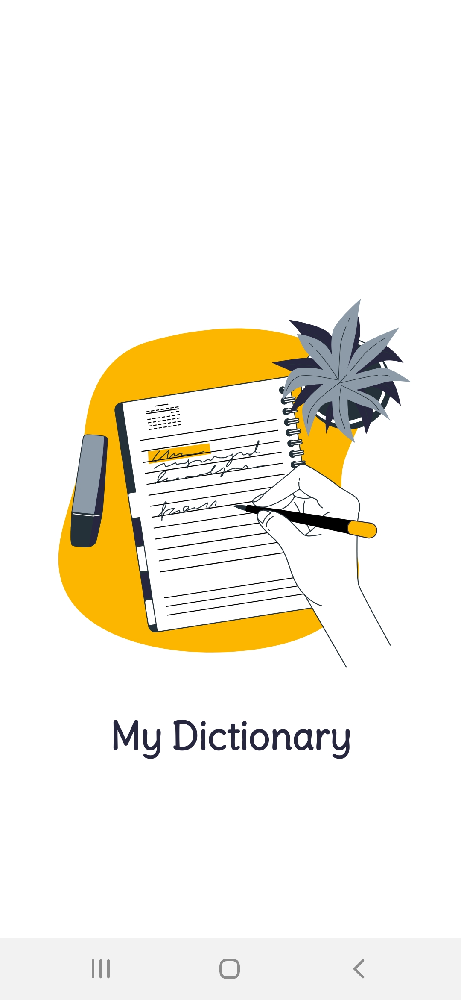 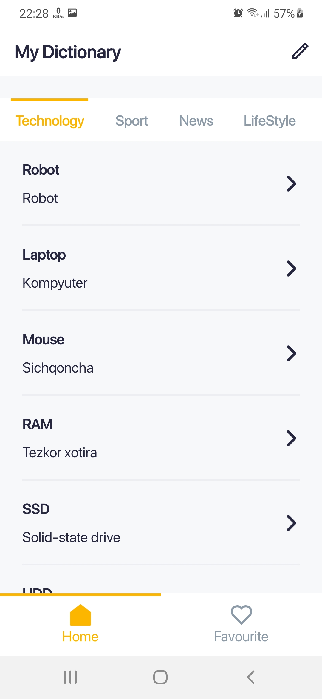
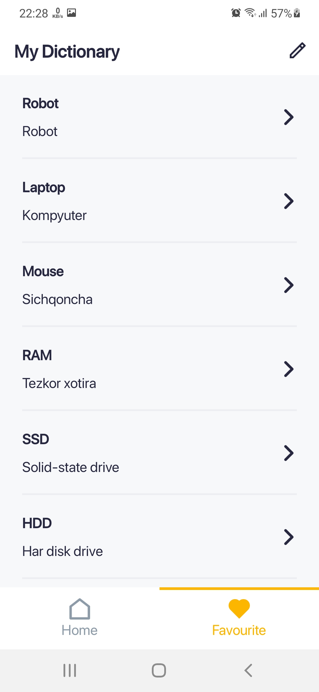 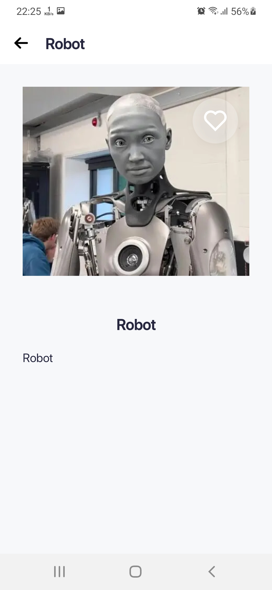 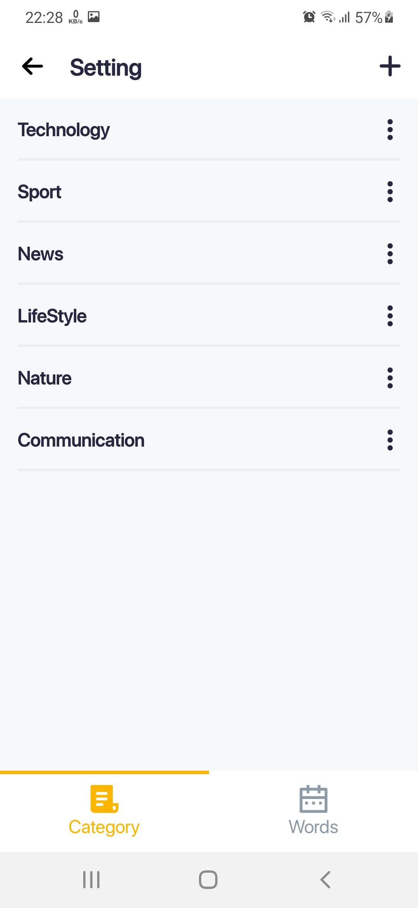
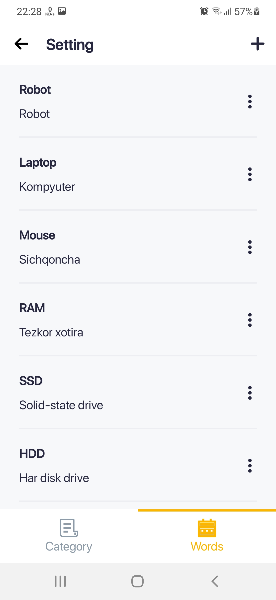 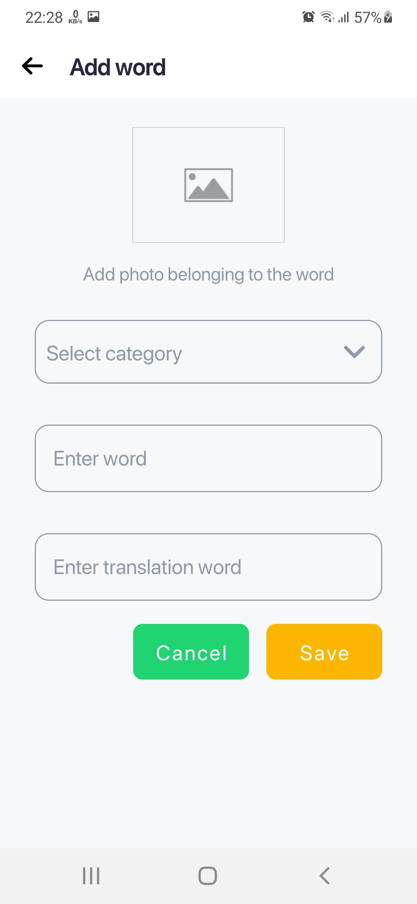 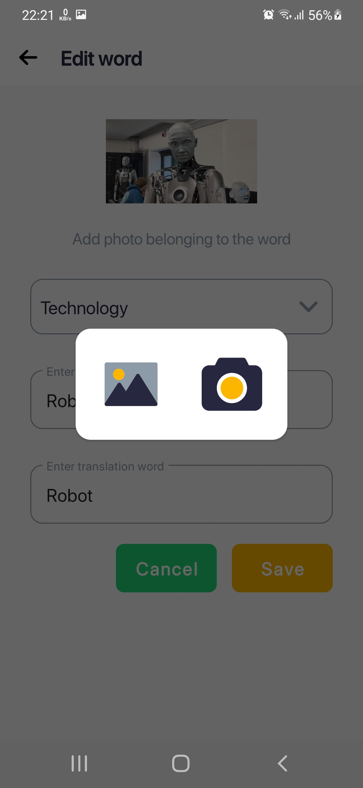
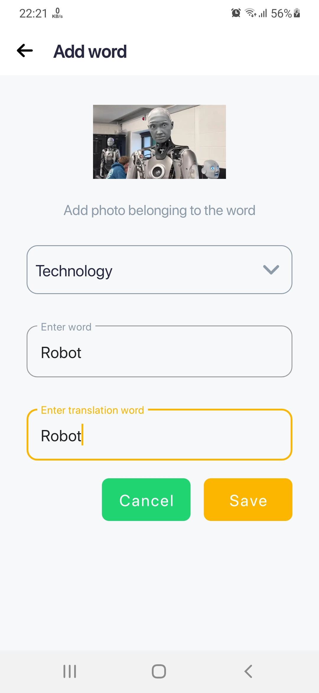 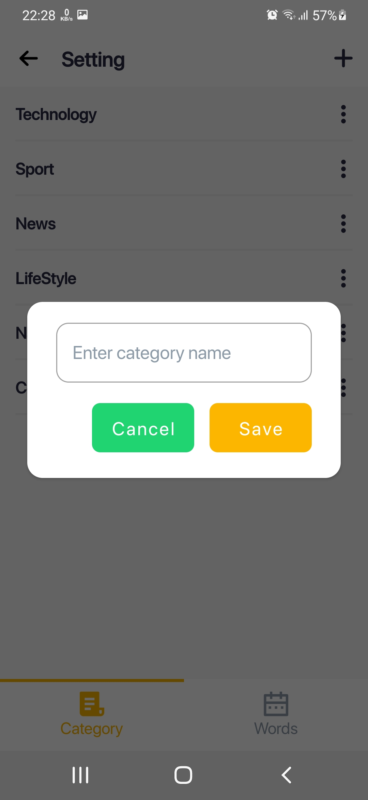

<h3>I have made icons for that app.<h3>

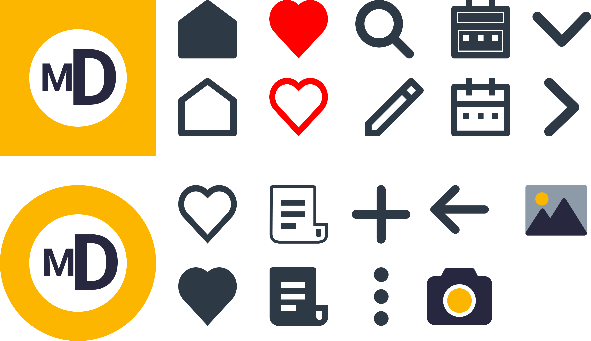

Resources:
 
<a href = "https://lottiefiles.com/80680-online-study">LottieFiles</a>

<a href = "https://www.figma.com/file/b04itioOHZFXmgeonQGMPw/My-Dictionary?node-id=0%3A1">Figma</a>

